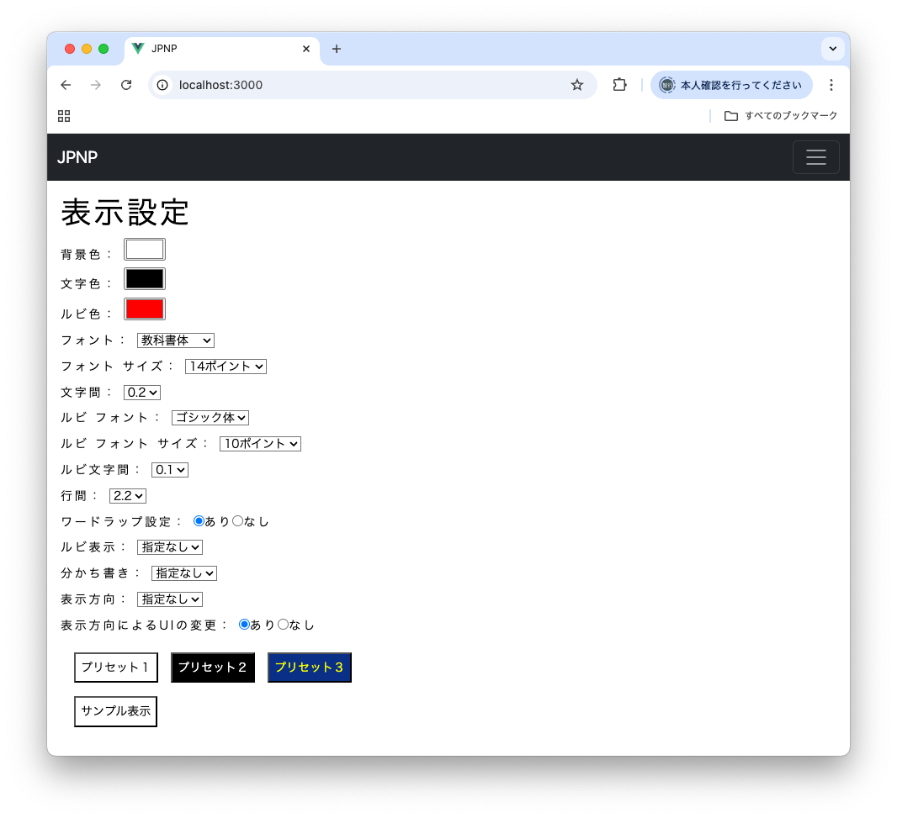
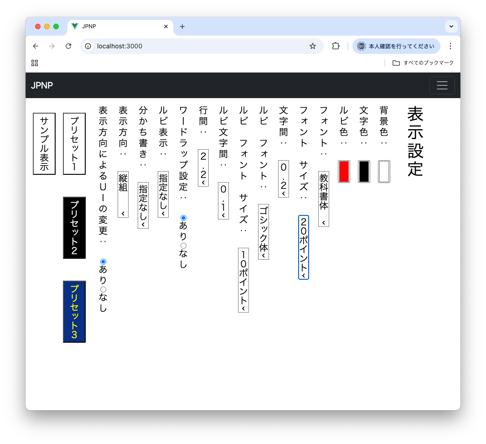
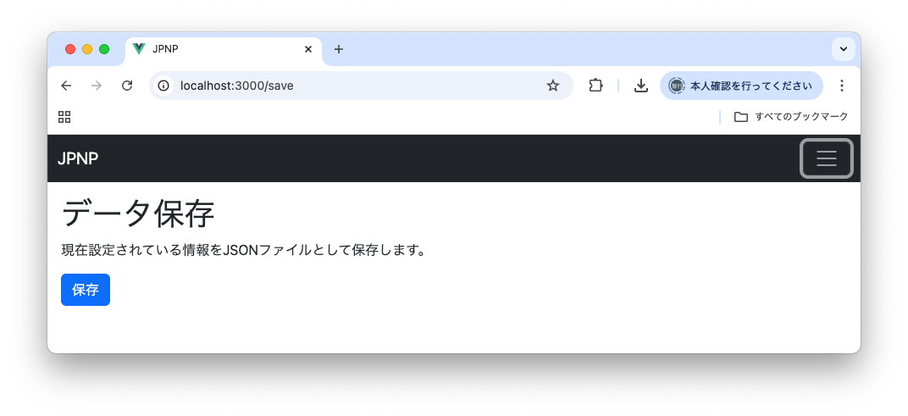
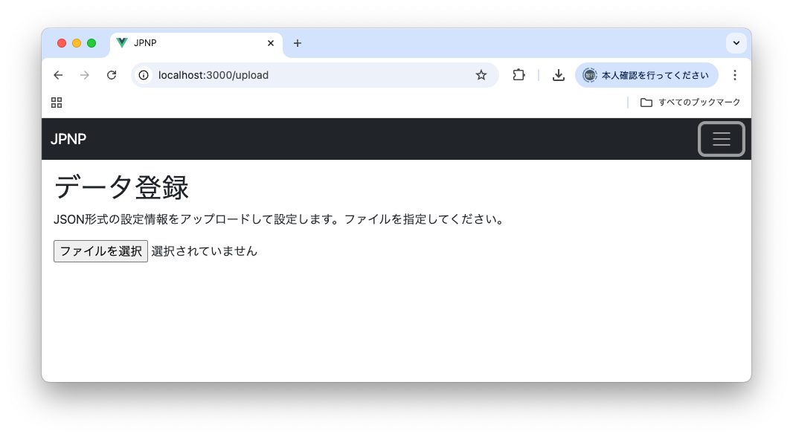
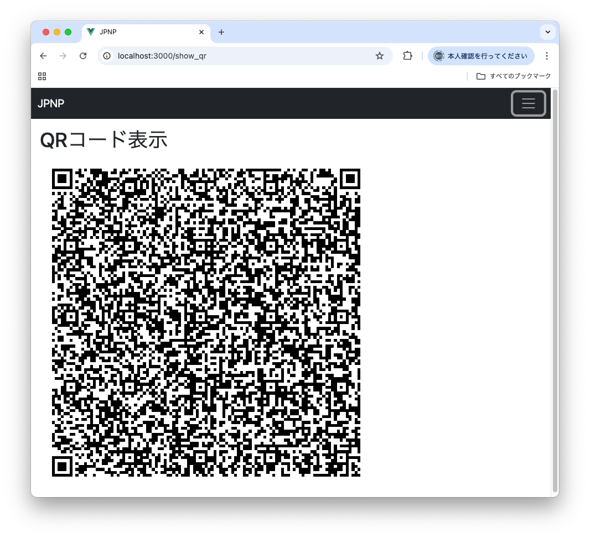
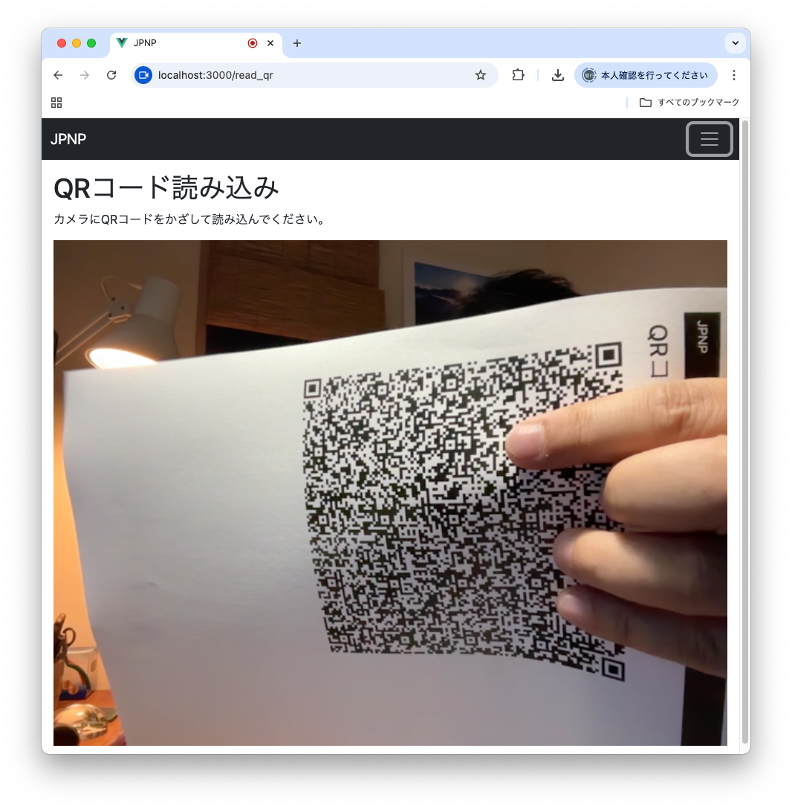
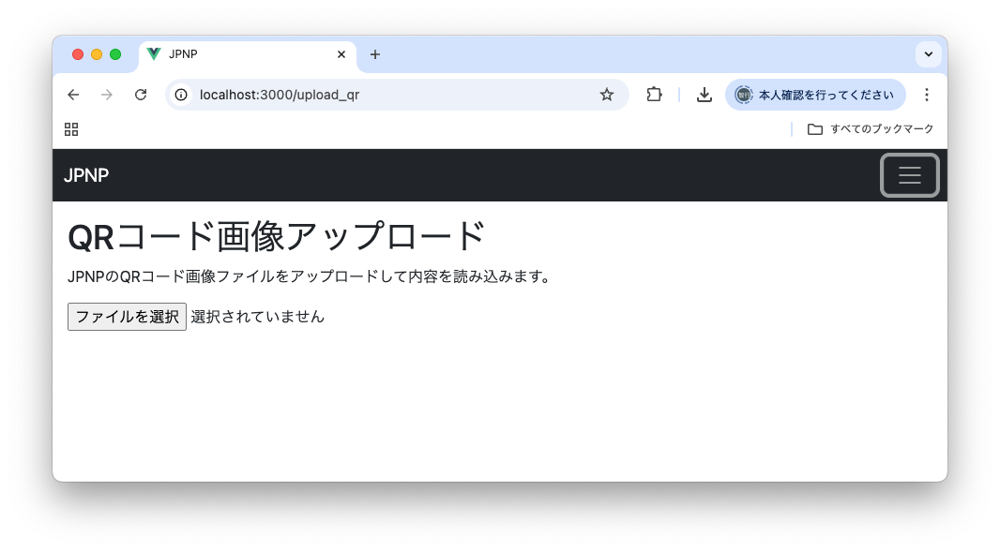
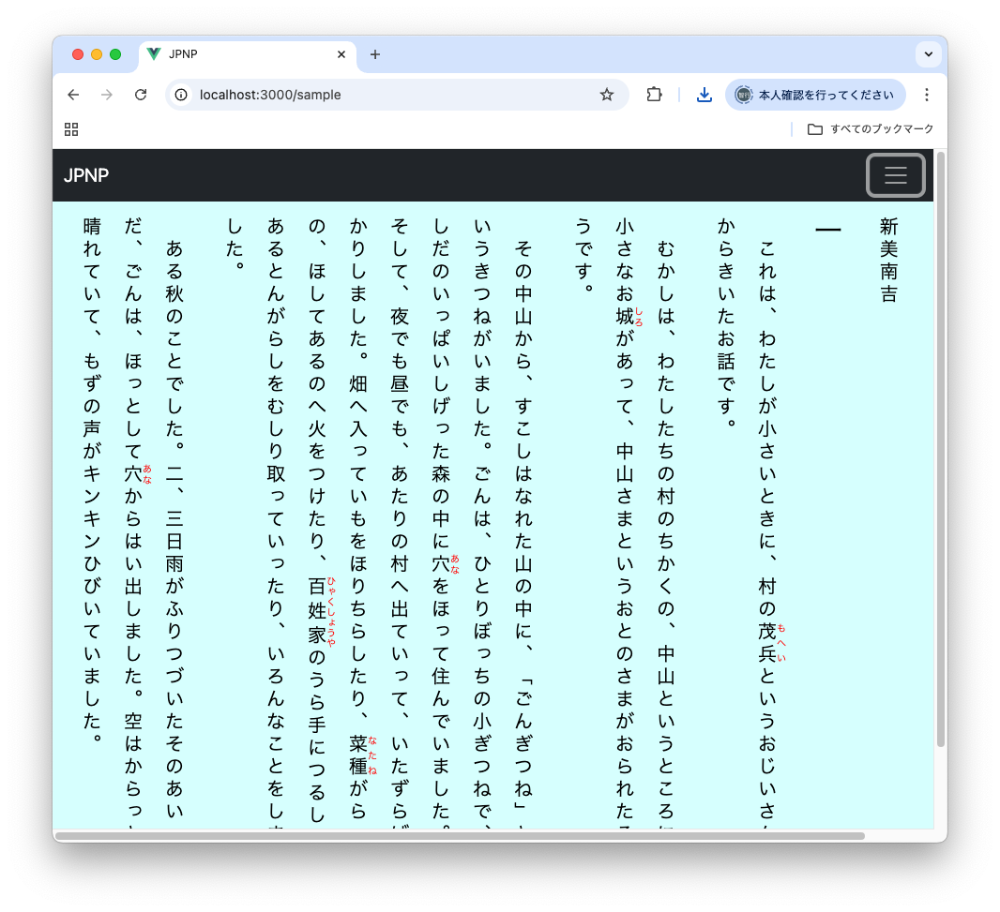
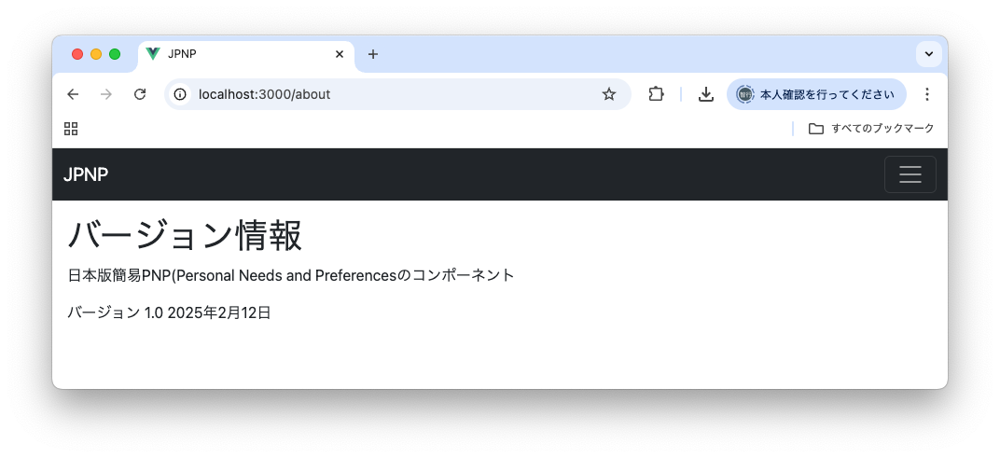
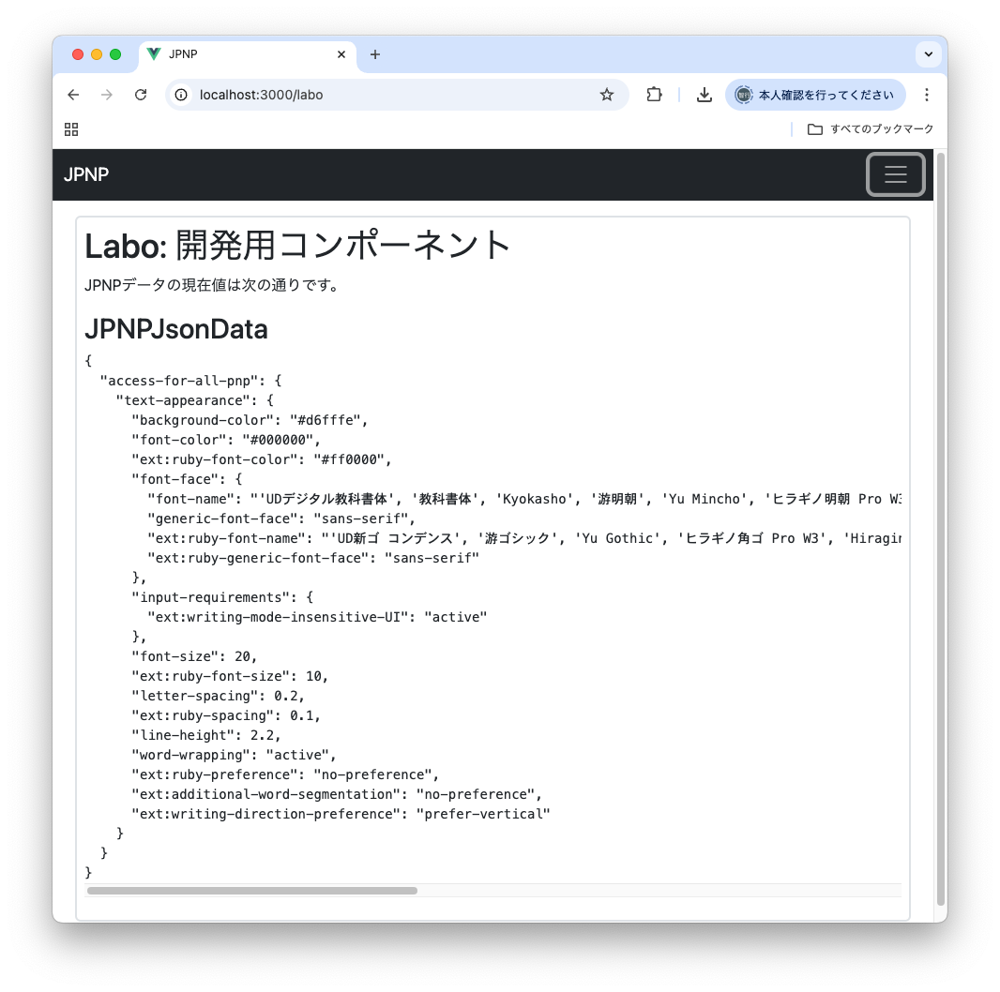

# 1. はじめに

このソフトウェアは、日本版簡易 PNP(Personal Needs and Preferences)の設定とQRコードの生成・解析を行うVue.js 3の環境下で使用できるJavaScriptコンポーネントです。

# 2. 機能

本コンポーネントには、以下の機能があります。

- 表示設定
- データ保存
- JSONデータ登録
- QR表示
- QR読み込み
- QRアップロード
- 表示サンプル
- About
- Labo

各機能はそれぞれ独立したコンポーネントとして実装しています。それぞれの機能の詳細は以下の通りです。

## 2.1 表示設定

JPNPで規定されている設定項目をUIで変更する機能です。設定できる項目は以下の通りです。

- 背景色
- 文字色
- ルビ色
- フォント：教科書体/ゴシック体/明朝体
- フォントサイズ
- 文字間
- ルビフォント
- ルビフォントサイズ
- ルビ文字間
- 行間
- ワードラップ：あり/なし
- ルビ表示：指定無し/総ルビ/パラルビ/ルビ無し
- 分かち書き：指定無し/空白/無し
- 表示方向：指定無し/縦組/横組
- 表示方向によるUIの変更：あり/なし

指定項目の値を変更すると、表示設定画面は指定結果を元にした表示方法にダイナミックに更新されます。

{ width=80% }

次の画面は表示方向を縦組に指定して、フォントサイズを20ポイントに変更したものです。

{ width=80% }

次の3つのプリセットボタンが用意されており、プリセットボタンを押すと代表的な色使いの設定に即座に切り替えられます。

- プリセット１
- プリセット２
- プリセット３

プリセット1は白地に黒の文字、プリセット２は黒地に白の文字、プリセット３は青地に黄色の文字の色使いになっています。
本システムのでのデフォルトの設定値はプリセット１のものなので、プリセット１のボタンは設定のリセット機能を兼ねています。

サンプル表示ボタンを押すと、設定値を適用した文書のサンプルが表示されます。

## 2.2 データ保存

設定したJPNPの内容をjsonファイルの形式で保存する機能を提供します。

{ width=80% }

「保存」ボタンを押すと、ローカルのデバイスにjson形式のJPNP設定ファイル(jpnp.json)を保存できます。

## 2.3 JSONデータ登録

データ保存でローカルに保存したjson形式のJPNP設定ファイルをブラウザにアップロードして設定値とする機能です。

{ width=80% }

## 2.4 QR表示

設定内容をQRコードで表示します。

{ width=80% }

この画面はブラウザの印刷機能を使って印刷できます。また、QRコードを右クリックすると表示されるポップアップメニューからQRコードの画像をファイルとして保存できます。

## 2.5 QR読み込み

{ width=80% }

デバイスのカメラからJPNPのQRコードを読み取ります。カメラに前述の機能を使って印刷したQRコードをかざして、以前の設定値を復元できます。
こちらの機能を利用するには、デバイスにカメラが必要です。

カメラへのアクセスについてはブラウザによるセキュリティ上の縛りが存在し、以下の2通りについてのみ許可されています。

- https:// のURLで動作していて、正しい電子証明書が設定されているWEBサーバ
- ローカルで動作しているWEBサーバ（http://localhost:ポート番号/）

http:// のWEBサーバで提供されているコンテンツからは、カメラへのアクセスが行えません。

## 2.6 QRアップロード

QRコードの画像ファイルをアップロードして、以前の設定値を復元する機能です。

{ width=80% }

## 2.7 表示サンプル

JPNPの設定値を適用した文書を表示するサンプルです。

{ width=80% }

表示設定画面のサンプル文書表示は、こちらのコンポーネントを内部に埋め込んで実現しています。

## 2.8 About

本コンポーネントのバージョン番号を表示します。

{ width=80% }

## 2.9 Labo

開発用の機能です。内部に読み込まれているJPNPのjson情報がリアルタイムに表示されます。

{ width=80% }

# 3 デプロイメント

## 3.1 ビルド環境

node.js v20.12.2とVue 3.0.4の組合せでビルドしています。

## 3.2 ブラウザ、サーバ

最新のChrome, FireFox, Safari, Edgeで動作を確認しています。
WEBサーバにdist以下のビルド済みのツリーを置き、ブラウザからindex.htmlをアクセスすると本コンポーネントを組み込んだサンプルページが起動します。WEBサーバ側にはCGIやバックエンドに関する設定は不要です。

## 3.3 ローカルでの開発用サーバ

Vueには、ローカルマシンで自前で開発用サーバを起動する機能があります。
node.js v20とnpmがインストールされている環境で、まず、次の手順で必要なモジュールのインストールを行います。

```
$ rm -rf node_modules
$ npm install
```

上記コマンドはMakefileのcleanとinstallのルールを用いても実行できます。

これでVue.jsを始めとする動作に必要なJavaScriptのモジュールがnode_modulesのディレクトリ下にインストールされます。
インストールが完了したらnpm run devのコマンドで開発用サーバーを起動できます。

```
$ npm run dev

> jpnp@0.0.0 dev
> vite

The CJS build of Vite's Node API is deprecated. See https://vite.dev/guide/troubleshooting.html#vite-cjs-node-api-deprecated for more details.

  VITE v6.1.0  ready in 124 ms

  ➜  Local:   http://localhost:3000/
  ➜  Network: use --host to expose
  ➜  press h + enter to show help

```

上記コマンドはMakefileのrunのルールを用いても実行できます。

ブラウザから画面に表示されるURLにアクセスすると、本コンポーネントのページが表示されます。

## 3.4 ビルド

開発用サーバではビルドは不要ですが、本番のデプロイメントのためにはビルドが必要です。Vue.jsは大量のコンポーネントで構成されていますが、これを1つのJavaScriptファイルにコンパイルするのがビルドのプロセスです。

以下のコマンドでビルドを行ってください。

```
$ rm -rf dist
$ npm npm run build
```

上記コマンドはMakefileのbuildのルールを用いても実行できます。

ビルドが完了すると、distディレクトリ下に次のようなコンパイル結果のファイルが生成されます。

```
$ ls -lR dist
total 24
drwxr-xr-x  4 kudou  staff   128 Feb 12 22:32 assets
-rw-r--r--  1 kudou  staff  4286 Feb 12 22:32 favicon.ico
-rw-r--r--  1 kudou  staff   833 Feb 12 22:32 index.html

dist/assets:
total 928
-rw-r--r--  1 kudou  staff      46 Feb 12 22:32 index-Bwborzv7.css
-rw-r--r--  1 kudou  staff  470945 Feb 12 22:32 index-CflQ3Tj3.js
```

このツリーをデプロイメント用のサーバにセットすれば、本機能が利用できます。

## 3.5 Dockerを使ったローカルのサーバ

Dockerを使ってnginxのコンテナを動作させWEBサーバを起動する設定ファイルを用意しました。
以下のコマンドでDockerのコンテナをビルドし、起動できます。

```
$ make docker-build
$ make docker-up
```

これで8400番のポートを通じてdistディレクトリ（上記のビルド結果が格納されたツリー）の内容を公開するWEBサーバが立ち上がります。

Dockerコンテナのサーバの停止は、次のようにします。

```
$ make docker-down
```

## 3.6 ソースファイル

今回開発したVue.jsのコンポーネントの主たるソースファイルは次の通りです。

- index.html：初回起動用ページ
- src/App.vue：全体を包括するトップレベルのコンポーネント
- src/index.css：css
- src/main.js：Vue.jsの起動用スクリプト
- src/components/SettingJPNPComponent.vue：表示設定用コンポーネント
- src/components/SampleComponent.vue：サンプル表示用コンポーネント
- src/components/Mbr.vue：＜mbr/＞タグの表示用コンポーネント
- src/components/SaveJPNPComponent.vue：JSON形式のJPNPファイル保存機能コンポーネント
- src/components/UploadJPNPComponent.vue：JSON形式のJPNPファイルアップロード機能コンポーネント
- src/components/ShowJPNPQRComponent.vue：QRコード表示用コンポーネント
- src/components/ReadJPNPQRComponent.vue：JPNP QRコード読み込み用コンポーネント
- src/components/UploadJPNPQRComponent.vue：QRコード画像アップロード機能コンポーネント
- src/components/AboutComponent.vue：バージョン表示用コンポーネント
- src/components/LaboComponent.vue：開発用コンポーネント
- src/components/Navbar.vue：ナビゲーションバーのコンポーネント
- src/assets/logo.png：ロゴ
- src/store/index.js：モデル部分のコンポーネント（本システムの核）
- src/router/index.js：ルーター（ナビゲーションメニュー用）
- package.json：依存パッケージ情報
- vite.config.js：viteの設定情報
- Makefile：ビルドルール
- docker-compose.yml：Docker Compose設定ファイル
- nginx/Dockerfile：nginxコンテナビルド用設定ファイル
- nginx/default.conf：nginxサーバ設定ファイル
- .vscode/launch.json：VScode+Chromeでのデバッカー動作に必要な設定ファイル
- doc/readme.md：本ドキュメントソース（マークダウン形式）
